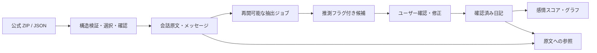

# Inner Weather

心の天気を、観察する。日記と ChatGPT の公式エクスポートをつなぐ、日本語中心のモバイルジャーナルです。感情を評価せず、観察・理解・受容を支えます。英語の本文も記録・検索できます。

Next.js / TypeScript / Tailwind CSS / Radix による shadcn スタイルの UI / Recharts。開発時は PostgreSQL 互換の PGlite、本番は Supabase PostgreSQL + Supabase Auth を使います。外部 AI は任意の OpenAI 接続です。

iPhoneで使うためのアカウント作成・接続設定・Vercelデプロイ・ホーム画面への追加は、[iPhone公開手順](docs/IPHONE_SETUP.md)を参照してください。公開前の設定を外部通信なしで確認する `npm run check:deploy` と、ホーム画面用のWeb Manifest・アイコンを用意しています。

## ローカル起動

Node.js 22 以上（検証環境は 24）、npm が必要です。

```bash
npm ci
npm run dev
```

ローカルのブラウザからポート 3000 を開き、「はじめての方はこちら」でアカウントを作成してください。外部サービスの認証情報なしで日記、インポート、候補の確認、グラフ、原文検索・振り返り、アンカー、録音が動きます。外部送信なしモードの抽出はキーワードに基づく候補、対話と振り返りは原文の整理です。生成 AI による分析と文字起こしは OpenAI 設定後に利用できます。

開発データと AES 鍵は `.inner-weather/` に保存します。このディレクトリは Git 対象外です。鍵を失うと本文を復号できないため、DB と鍵を一緒に安全にバックアップしてください。初回の PostgreSQL エンジン初期化には数秒かかります。PGlite は単一プロセス専用です。同じ保存先で複数サーバーや別ワーカーを起動しないでください。

環境変数を使う場合は `.env.example` を `.env.local` にコピーして編集します。秘密情報をコミットしないでください。CLI スクリプトも Next の環境変数を読み込みます。

```bash
npm run typecheck
npm test
npm run build
# ローカルで本番ビルドを試す場合に限る、本番環境には設定しない
INNER_WEATHER_LOCAL=1 npm run start
```

元の `index.html` は保持しています。アプリは `src/app/page.tsx` から起動します。

## 実装したフロー

- **Home**：今日の最新記録、感情の入力、最近の日記、記録カレンダー。
- **Journal**：作成・編集・削除、感情を複数記録、身体・出来事・気づき・価値観などの記録、原文検索、会話の分岐表示、アンカー。
- **Import**：ZIP / JSON の構造検証、会話選択、件数・期間・費用のプレビュー、開始前の確認、差分取り込み、原文と候補の分離、進捗、中断・再開・再試行、インポート単位の削除。
- **確認・修正**：候補の推測フラグ・信頼度・根拠・出来事日付を確認。修正した日記だけを感情グラフに集計。
- **Insights**：週間・月間・年間の感情・エネルギー・ストレス・気分、点から日記を参照、週次・月次レビュー、過去の類似記録。
- **Reflect**：日記と選択経路のユーザー発言を横断検索。自然言語のキーワードと期間から候補を取得し、回答に日付と原文リンクを付ける。
- **Settings**：表示タイムゾーン、ダークモード、外部送信の同意、平文 JSON 書き出し、全記録削除、アカウント削除。
- **音声**：MediaRecorder で最大3分の録音、再生・ダウンロード、音声ファイル選択。OpenAI の文字起こしは別の明示的な送信操作が必要。

AI の分析は推測であり、心理的診断ではありません。外部送信なしの整理を生成 AI の分析とは表示しません。

## Supabase の設定

実接続にはユーザーが管理する検証用プロジェクトを使ってください。既存アプリのテーブルとの衝突を避けるため、専用プロジェクトを推奨します。プロジェクト作成・課金・本番公開はこの実装から自動実行しません。

1. Supabase のプロジェクト URL、publishable/anon key、DB 接続文字列を環境設定へ登録します。
2. SQL Editor で `supabase/migrations/001_inner_weather.sql` を実行するか、管理者の DB 接続で `npm run migrate` を実行します。マイグレーションは追加・再実行可能な DDL です。業務データを初期化しません。
3. Auth の Email/Password を有効にし、Site URL をアプリの HTTPS URL に設定します。確認メールを有効にしている場合はメール確認後にパスワードでログインしてください。
4. 本番用の32バイト AES 鍵を生成し、サーバー環境へ固定して設定します。鍵はブラウザへ渡しません。既存データの鍵を突然変更しないでください。
5. アカウント完全削除を有効にするにはサーバー専用 `SUPABASE_SERVICE_ROLE_KEY` も設定します。未設定の場合は理由を表示し、全記録削除は引き続き利用できます。

| 変数                        | 用途                                                                                                                                 |
| --------------------------- | ------------------------------------------------------------------------------------------------------------------------------------ |
| `DATABASE_URL`              | Supabase PostgreSQL のサーバー接続。URL のパスワードを percent-encode。transaction pooler も利用可能（prepared statements は無効）。 |
| `SUPABASE_URL`              | `https://<project-ref>.supabase.co`                                                                                                  |
| `SUPABASE_ANON_KEY`         | Supabase Auth 用 publishable / anon key。サーバーで使用。                                                                            |
| `SUPABASE_SERVICE_ROLE_KEY` | Auth Admin API のアカウント削除用。ブラウザで使用しない。                                                                            |
| `DATA_ENCRYPTION_KEY`       | 64桁の16進数（32バイト）。AES-256-GCM。例：`openssl rand -hex 32` で生成。                                                           |
| `APP_ORIGIN`                | 実際のアプリの origin（scheme + host + port、末尾 `/` なし）。CSRF検証に使用。                                                       |
| `DATABASE_SSL_CA_FILE`      | 任意。Supabase が指定する信頼済み CA 証明書のファイル。証明書検証は常に有効。                                                        |
| `DATABASE_SSL_CA`           | 任意。Vercelでは信頼済みCA証明書のPEM本文を設定可能。改行または `\n` を受け付け、ファイル設定より優先。証明書検証は常に有効。            |

DB パスワード・AES 鍵はローカルの接続・暗号処理に使う実値が必要です。HTTPS プロキシで送信時に置換されるプレースホルダーを `DATABASE_URL` や AES 鍵に使わないでください。環境の安全な変数・秘密情報の設定を利用してください。

全ユーザーテーブルで RLS を有効にし、リクエストごとのトランザクション内で `authenticated` ロールと検証済み user ID を設定します。tenant-aware な複合外部キーも使い、別ユーザーの行への参照を DB 自体で拒否します。パスワード・セッショントークンのテーブルは `authenticated` からアクセスできません。認証の登録とワーカーのジョブ列挙だけが管理接続を使います。

`DATABASE_URL` 未設定の本番起動は拒否します。Supabase 設定が不完全なときはローカル認証へ自動フォールバックしません。

## OpenAI の設定と外部送信

`OPENAI_API_KEY` をサーバー環境に設定してください。Codex クラウドで予約済み変数名を使用できない場合は **`IW_OPENAI_API_KEY`** を同じ用途に使えます。プロキシ秘密情報の許可先は `api.openai.com` です。ブラウザや `NEXT_PUBLIC_*` へキーを設定しないでください。

- モデル：`OPENAI_MODEL`（初期値 `gpt-4.1-mini`、Structured Outputs に対応するモデル）。音声は `whisper-1`。
- プライバシー設定で同意し、各操作で送信範囲を確認して、さらにチェックボックスを選択します。同意を取り消すと新しい外部処理を止めます。送信済みリクエストは取り消せません。
- 抽出：選択経路の **user 本文のみ**、最大3,000文字ずつとメッセージ日時。assistant / system / tool、会話タイトル、添付バイナリは送信しません。
- 対話・レビュー：質問、関連するユーザー発言・確認済み日記を最大12件。各本文3,000文字、日付、確認済み項目を最大1,000文字。レビューでは過去の類似記録を最大2件含めます。
- 音声：利用者が選択した1つの音声ファイルだけを文字起こし時に送信します。
- `AI_INPUT_USD_PER_MILLION` / `AI_OUTPUT_USD_PER_MILLION` は概算用単価。使用するモデルの最新料金に合わせて更新してください。`AI_JOB_BUDGET_USD` はインポートジョブの概算費用上限（初期値 $1）。費用を超える見込みの次の送信を停止します。
- 使用量は取得できた API 応答に基づきます。検証に失敗した応答の使用量も計上します。通信断やプロセス停止で応答が取得できない場合、表示に含まれない請求があり得るため API の請求明細を確認してください。API 側の予算上限も設定してください。

文章を信頼できない JSON のデータとして渡し、会話内の命令をシステム指示として扱わないプロンプトを使用します。Zod で構造化出力、感情スコア、根拠が原文の部分文字列であること、引用IDが取得済みの記録であることを検証します。AI の出来事日付は原文に根拠がある場合のみ採用します。この対策は生成内容の完全な正しさを保証しないため、確認・修正の画面を必須にしています。

## インポートの整合性とジョブ



- `mapping` の親子関係と `current_node` を復元します。選択ノードがない場合、葉が1つのときだけ経路を復元します。曖昧・循環・欠損経路は自動抽出せず、警告と原文を保持します。テキストがないメッセージは空の本文として保持し、未知のレコードは警告してスキップします。
- ZIP はディスクへ展開しません。25 MB の入力、50 MB の個別展開、100 MB の総展開、100倍の圧縮率、件数の上限を適用します。パストラバーサル、重複パス、シンボリックリンク、暗号化 ZIP、ZIP64、CRC 不一致を拒否します。サイズ上限は `MAX_UPLOAD_MB` で下げられます。
- 会話ID・メッセージIDで原文を重複させません。同じ ID に本文差異があれば最初の原文を保持し、警告します。新しい ID は差分として追加します。
- 200メッセージを超えるインポートでは、正規化した原文を暗号化してジョブに先に保存し、25メッセージずつ DB に取り込みます。取り込みカーソルはトランザクションで保存され、最後に一時ペイロードを消去します。
- AI 抽出は1回の step で1分割だけ処理します。60秒のリース、3回までの自動再試行、5秒・10秒等の待機、ユーザーによる中断・再開を使います。原文メッセージ + 分割番号の UNIQUE 制約により再処理で候補を増殖させません。
- ブラウザを閉じるとローカルの処理は止まります。次回ログイン時に続きから進みます。常駐ワーカー設定時はブラウザを閉じても処理できます。
- 確認後の日記・スコアは候補と別テーブルに保存します。原文と AI 候補を修正で上書きしません。同じ候補を再確認しても日記は1件です。
- 同じ原文を複数インポートから参照している場合、1つのインポートを削除しても共有原文を残します。最後の参照が消えた原文は候補・確認済み日記・スコア・アンカーとともに cascade 削除します。
- 記録の修正・削除時は古い抜粋が残らないよう、保存済みインサイトと対話履歴を無効化・削除します。

### 日付

メッセージ日時は UTC の `timestamptz`、出来事の日付は暦日の `date` です。表示はプロフィールのタイムゾーンへ変換します。

原文の `2026年10月4日` / `2026-10-04` / `October 4, 2026` 等は確認できる日付、年のない `10月4日` は記録年を用いた**推定日付**です。相対日付・日付なし・複数の異なる日付は不明として確認を求めます。不明を記録日時で埋めません。ユーザーが手動で修正できます。

未確認候補と日付不明の日記はグラフに含めません。感情未記録は `null`、記録した0は `0`。同日の複数記録は感情ごとの平均です。

## バックグラウンドワーカー

Supabase 接続時は、同じ環境変数を設定した Node サービスで実行できます。

```bash
npm run worker
```

またはスケジューラーから `POST /api/worker` を呼び、`Authorization: Bearer <WORKER_SECRET>` を指定してください。`WORKER_SECRET` は32文字以上です。1リクエストにつき最大1つの bounded step を実行します。複数ワーカーでもリースで競合を防ぎます。インポートの解析を fire-and-forget のサーバーレス Promise に依存させていません。

Vercel の標準 cron は GET のため、そのままこの POST エンドポイントには使いません。POST と秘密ヘッダーに対応する外部スケジューラー、または常駐 Node ワーカーを設定してください。

## テスト

```bash
npm run typecheck
npm test
npm run build
# ブラウザがない環境では先に実行
npx playwright install chromium
npm run test:e2e
```

Linux に `/usr/bin/chromium` があれば使用し、なければ Playwright の Chromium を使います。`CHROMIUM_PATH` で上書きできます。

単体・統合テストは独立した PGlite を使い、実サービスへ接続しません。AI 応答は合成データでモックし、外部ネットワークを禁止しています。E2E も外部接続変数を明示的に空にした専用 DB で起動します。

テスト対象：JSON/ZIP、選択分岐・循環、マルチモーダル、ZIP セキュリティ、UTC/表示日時、出来事日時、重複/差分、保存・抽出の中断再開、競合、AI出力検証/リトライ/使用量、同意撤回、予算、感情修正とグラフ、引用、RLSと外部キーによるユーザー分離、削除整合性。

iPhone 13 のサイズを使った Chromium E2E では、日記 CRUD → ZIP の確認 → 候補修正 → グラフ → 振り返り → 原文リンク → ダークモード → データ削除を検証します。録音は合成マイク入力で検証します。実機 Safari のマイク許可・録音形式の動作確認は別途必要です。

## 承認後の実接続検証

`npm run verify:live` は必要な設定の名前だけを確認します。すべて設定済みで、合成データの外部送信と少額の API 利用を承認した後に、次のように実行します。

```bash
LIVE_TEST_APPROVED=1 npm run verify:live
```

このスクリプトは2つの合成 Supabase Auth アカウントを作成し、認証、RLS、日記、原文取り込み、OpenAI 抽出・週次/月次レビュー・参照付き対話を検証します。OpenAI は最大5回の成功リクエスト（抽出の再試行がある場合は追加）を実行します。終了時は合成アカウントと記録を削除します。本文・キー・トークンはログ出力しません。既存ユーザーの記録を検証に使いません。DB のマイグレーションは先に完了させてください。

## 本番デプロイ

1. Supabase の検証用設定でマイグレーション・認証・ユーザー分離を確認します。
2. Vercel にこの Next.js リポジトリを登録し、上記サーバー環境変数を設定します。課金・公開は利用者が承認して実施してください。
3. `INNER_WEATHER_LOCAL` を**設定しない**でください。永続データを Vercel の一時ファイルシステムに置かず、Supabase PostgreSQL を使います。
4. Vercel の function アップロード制限を考慮し、Vercelでは未設定でもアップロード上限が4 MBになります。`MAX_UPLOAD_MB`を明示する場合も1〜4にしてください。コンテナの既定値は25 MBです。大容量の Storage 直接アップロードフローは未実装です。
5. ワーカーまたは POST スケジューラーを設定します。HTTPS、DBバックアップと鍵管理、認証用WAF/永続レート制限、ログに本文やキーを出さない運用を設定します。
6. 合成エクスポートと2つのテストアカウントで、認証・RLS・AI送信同意・ZIP・削除をステージング確認してから公開します。

```bash
# イメージ内に .env や秘密情報を含めない
 docker build -t inner-weather .
# 本番用の Supabase 等を設定した安全な env ファイルをランタイムで指定
 docker run --rm -p 3000:3000 --env-file .env.production inner-weather
```

アプリは HTTPS 配下で利用してください。Secure / HttpOnly / SameSite Cookie、origin 検証、セキュリティヘッダー、入力/容量制限、パラメーター化 SQL と RLS を実装しています。レート制限は現状1プロセスのメモリー内です。本番の水平スケールには WAF または共有レート制限が必要です。

本文・会話タイトル・メタデータ・AI内容は AES-256-GCM で保存します。ID・日時・感情スコア・プロフィール等の索引情報は暗号化ペイロードの外にあるため、インフラの保存時暗号化とアクセス制限も必要です。削除は稼働中DBからの削除で、バックアップの保管期限・物理媒体の消去は運用者が管理してください。

## 検証状況と制限

ローカルの型チェック、ビルド、合成データの単体・統合テスト、ブラウザ E2E を実行しています。E2Eでは登録・ログアウト・再ログインも確認します。**Supabase・OpenAI の実接続と本番デプロイの動作は、認証情報の登録が完了するまで未検証です。** 外部 AI なしの整理は生成 AI と同等の分析を約束しません。

- 取り込み対象はテキスト本文と利用可能なメタデータです。画像/音声/添付のバイナリ、ZIP内の別ファイル、ChatGPTへの直接ログイン・スクレイピングは対象外です。
- 検索は日本語の文字 n-gram・英単語と期間フィルターです。ベクトル埋め込みによる検索は未実装です。大量の個人データでは検索用索引・ページングの追加を推奨します。
- 音声は画面内の一時保持です。録音原本のクラウド永続保存は行わず、必要なら利用者がダウンロードします。
- Supabase Auth のアクセストークンは1時間の Cookie です。期限後は再ログインが必要です。パスワード再設定 UI・多要素認証 UI は未実装です。
- JSON の書き出しはできますが、Inner Weather の書き出しを再取り込みする復元フローは未実装です。ChatGPTエクスポートのインポートとは別です。
